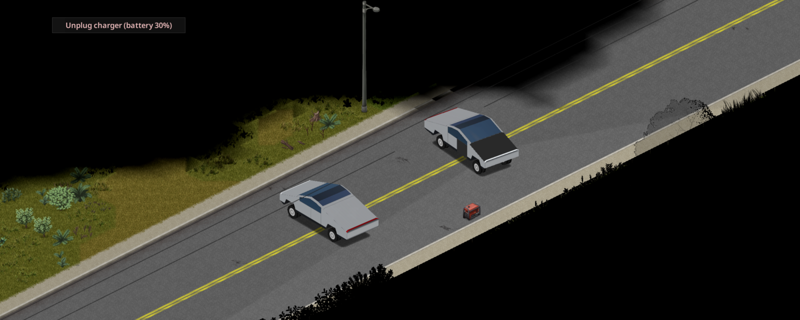
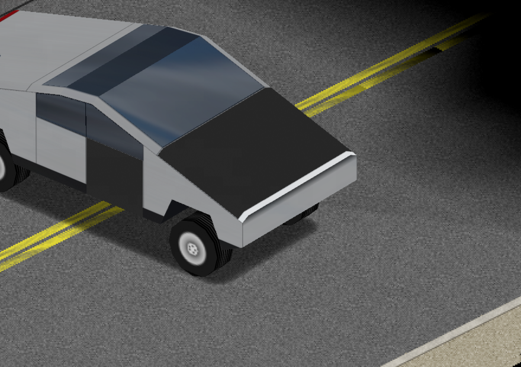

# How to use the Cybertruck

## 1. Find or build one
Look in upscale neighborhoods, professional lots and luxury dealerships. Or, with Mechanics 8, Welding 7 and Electrical 6, craft **Build Cybertruck** (Metalworking). The new truck rolls out a few tiles away, and the key goes into your inventory.

## 2. Keep it charged
The dash fuel gauge is your battery. Right-click the truck, or press **V** next to it, and pick **Plug in to charge**. You need one of these:
- **A running generator** with fuel, within 12 tiles on the same floor. Charging burns its fuel (half a tank for a full charge by default).
- **A powered building** within 4 tiles, while the grid is still up.

A full charge takes about 10 in-game hours. The cable comes out on its own when you start the motor, when the generator runs dry, or when the power goes out.

## 3. Drive it
It pulls hard, weighs a lot, and barely makes a sound, so it's great for sneaking past hordes. The battery drains faster at speed, and running the heater and headlights costs a little extra. Ease off before you stop and the regen puts some charge back.

## Armor
The stainless panels and armored glass shrug off most damage. When something does get through, repair or replace it like any vanilla part. The glass takes the mod's own **Armored Glass** parts.

## Troubleshooting
If something goes wrong, open an issue with the last 50 lines of `Zomboid/console.txt`:
https://github.com/HxHippy/pz-cybertruck/issues
