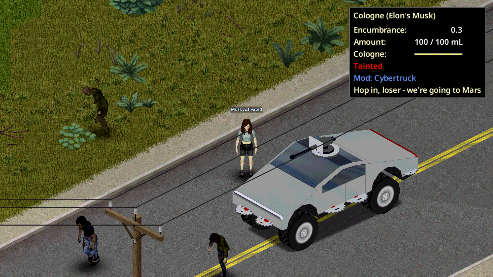

# How to use the Cybertruck

## 1. Find or build one
Look in upscale neighborhoods, professional lots and luxury dealerships. Or, with Mechanics 8, Welding 7 and Electrical 6, craft **Build Cybertruck** (Metalworking). The new truck rolls out a few tiles away, and the key goes into your inventory.

## 2. Keep it charged
The dash fuel gauge is your battery. The charge port is the driver-side taillight, behind the rear wheel. Right-click the truck, or press **V** next to it, and pick **Plug in to charge**. You need one of these:
- **A running generator** with fuel, within 12 tiles on the same floor. Charging burns its fuel (half a tank for a full charge by default).
- **A powered building** within 4 tiles, while the grid is still up.

A full charge takes about 10 in-game hours. The cable comes out on its own when you start the motor, when the generator runs dry, or when the power goes out.

## 3. Drive it
It pulls hard, weighs a lot, and barely makes a sound, so it's great for sneaking past hordes. The battery drains faster at speed, and running the heater and headlights costs a little extra. Ease off before you stop and the regen puts some charge back.

## 4. Bolt on the apocalypse fittings
Found trucks and built trucks both come bare. Craft the fittings under Metalworking, then install them from the mechanics screen with a wrench and a screwdriver: the blade kit from the vault, the hatch and gun from the front passenger door.

- **Blade kit** (craft: Mechanics 4, Welding 4). Six circular saw blades, sheet metal and pipe. Saws along both rockers, behind the rear wheels and across the front bumper.
- **Roof hatch** (craft: Mechanics 3, Welding 3). Sheet metal, pipe and a glass panel.
- **Roof gun** (craft: Mechanics 5, Electrical 3, Welding 3). Eats one assault rifle or varmint rifle. The hatch has to be on first.

### The blades

The driver switches them from the vehicle menu (**V**): **Spin up the blades**. They wind up whenever the motor runs and there's charge in the pack, and they draw a little power the whole time. What they do while spinning is up to the sandbox:

- **Blades shred and plow zombies.** Any zombie that gets inside the blade line dies, including one grabbing at a door while you're parked. Bodies you hit stop costing you speed. Walls, cars and trees still stop you.
- **Blades cut trees.** Ordinary trees in your path come down before the bumper reaches them, driving or reversing, and drop their wood like a tree you felled by hand. Giant trees stay up. Each tree costs a little charge.

### The roof gun
Get in the front passenger seat, or stop the truck and use it from the driver's seat. The zombie nearest your cursor gets a red outline, and that's the one the gun is on. Hold the **left mouse button** (or **K**, rebindable under Options > Mods) for automatic fire. It hits more often up close and from a parked truck, and it's loud.

The gun takes loose 5.56 from your pockets first, then from the vault. On a controller, open the vehicle menu and pick **Fire roof gun** for a three-round burst at the nearest zombie. With the truck stopped, anyone in the cab can take **Climb into the hatch** from the same menu.

### Sandbox dials
Everything above lives under **Apocalypse fittings** on the Cybertruck sandbox page: whether found trucks come with the fittings, whether the blades are drawn, what spinning blades do, how hard they drain the pack, and whether zombies killed by the bumper put charge back.

## 5. Elon's Musk
Every Cybertruck comes with one bottle of **Elon's Musk** in the glovebox. Right-click it and pick **Spritz on some of Elon's Musk**. For the next in-game hour, any zombie within 10 tiles drops you as a target and walks the other way. A bottle holds five spritzes, and a second spritz while one is running adds another hour.

It keeps them off you. It doesn't kill them, and they come back once it wears off.

## Armor
The stainless panels and armored glass shrug off most damage. When something does get through, repair or replace it like any vanilla part. The glass takes the mod's own **Armored Glass** parts.

## Troubleshooting
If something goes wrong, open an issue with the last 50 lines of `Zomboid/console.txt`:
https://github.com/HxHippy/pz-cybertruck/issues
