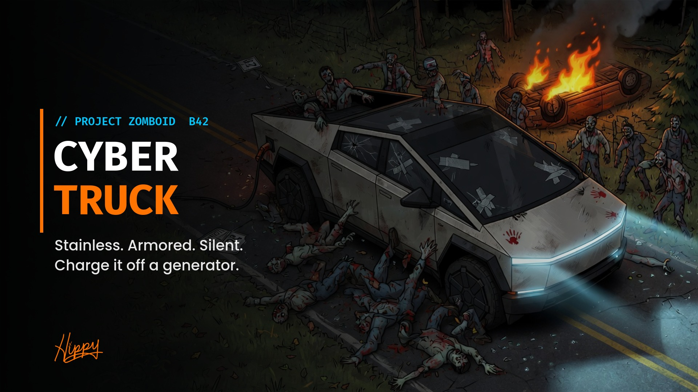

# Cybertruck



**A fully loaded electric Cybertruck for Project Zomboid Build 42. Charge it off a generator.**

**[How to use it](GUIDE.md)** | **[Issues](https://github.com/HxHippy/pz-cybertruck/issues)**


## What it does
- **Electric drive.** A 100% battery pack replaces the gas tank, and gas cans and pumps don't work on it. It draws almost nothing while idling, drains faster the harder you drive, and gives a little back when you slow down.
- **Charge it anywhere there's power.** Park within 12 tiles of a running generator, right-click the truck, and pick **Plug in to charge**. Charging burns generator fuel. While the grid is still up, you can also charge next to a powered building for free.
- **Near-silent motor.** Engine loudness is 20 (the vanilla SUV is 100), and it runs on a quiet electric whine instead of a V8.
- **Stainless exoskeleton and armored glass.** The glass is 30x tougher than vanilla against weapons, and the doors, hood and vault are 12x tougher. The armor also soaks up 90% of zombie hits and crash damage, and smaller hits still add up over time.
- **Top-tier everything.** Modern tires, brakes and suspension, a HAM radio, 4 seats, a 160-unit locking vault, the heaviest and fastest chassis in the game, and front and rear crash health of 600.

## Getting one
Both options are sandbox toggles, so the world creator (or server admin) decides:
- **Spawns in the world:** rare, in upscale neighborhoods, professional lots and luxury dealerships. The spawn weight is adjustable.
- **Build it:** the **Build Cybertruck** recipe (Mechanics 8, Welding 7, Electrical 6) rolls a new truck out next to you and hands you the key. It comes with a nearly empty battery, so go find a generator.

## Sandbox options
| Option | Default |
|---|---|
| Spawns in the world | on |
| Spawn weight | 3 |
| Can be built | on |
| Battery drain multiplier | 1.0 |
| Hours for a full charge | 10 |
| Generator fuel per full charge (percent of a tank) | 50 |
| Charge from building power | on |
| Armor absorbs (percent of each hit) | 90 |

## Multiplayer
Charging, drain and armor all run on the server. Plugging in is a client command that the server checks: the engine has to be off and a live charger has to be in reach.

## Install
- **Manual:** copy this folder to `~/Zomboid/Workshop/Cybertruck` and enable **Cybertruck** in Mods. Copy it instead of symlinking it, because the game won't load vehicle scripts through a symlink.
- **Dedicated server:** add `Cybertruck` to `Mods=`.

## Layout
```
Contents/mods/Cybertruck/42/
  mod.info, poster.png, icon.png
  media/models_X/vehicles/Vehicles_Cybertruck.fbx
  media/textures/Vehicles/vehicle_cybertruck_{shell,mask,lights}.png
  media/sound/cybertruck_{motor,start,stop}.ogg
  media/scripts/  vehicle, model, items, recipe, sounds
  media/sandbox-options.txt
  media/lua/  shared (charger lookup), server (battery, armor, spawns, build), client (plug-in menu)
tools/
  build_model.py   builds the mesh and all three textures from one set of triangles
  build_sounds.py  synthesizes the motor loop and chimes
```
Rebuild the model with `python3 tools/build_model.py <game>/media/models_X/vehicles/Vehicles_PickUpTruck.fbx`. It borrows only the vanilla FBX header layout. The geometry is generated.

## License
MIT

---
Made by **HxHippy**. Built by Kief Studio, powered by LTFI.
