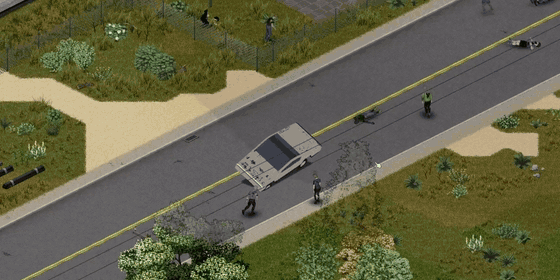
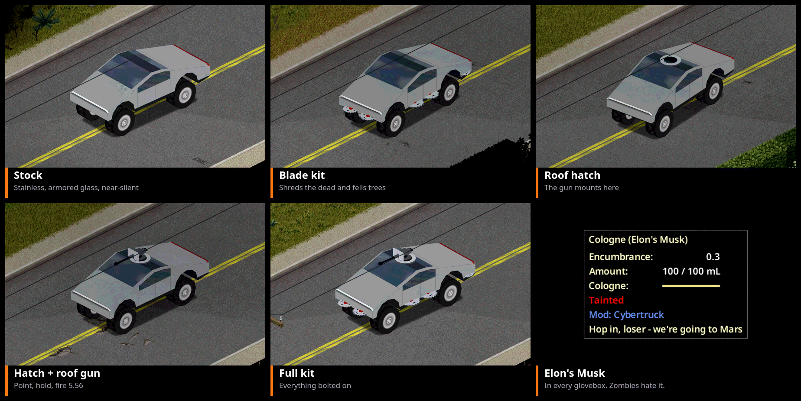
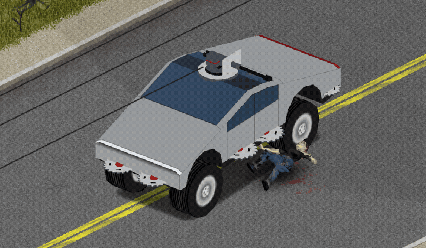

# Cybertruck


**A fully loaded electric Cybertruck for Project Zomboid Build 42. Charge it off a generator.**

**[How to use it](GUIDE.md)** | **[Steam Workshop](https://steamcommunity.com/sharedfiles/filedetails/?id=3808581322)** | **[Issues](https://github.com/HxHippy/pz-cybertruck/issues)**




## What it does
- **Electric drive.** A 100% battery pack replaces the gas tank, and gas cans and pumps don't work on it. It draws almost nothing while idling, drains faster the harder you drive, and gives a little back when you slow down.
- **Charge it anywhere there's power.** Park within 12 tiles of a running generator, right-click the truck, and pick **Plug in to charge**. Charging burns generator fuel. While the grid is still up, you can also charge next to a powered building for free.
- **Near-silent motor.** Engine loudness is 20 (the vanilla SUV is 100), and it runs on a quiet electric whine instead of a V8.
- **Stainless exoskeleton and armored glass.** The glass is 30x tougher than vanilla against weapons, and the doors, hood and vault are 12x tougher. The armor also soaks up 90% of zombie hits and crash damage, and smaller hits still add up over time.
- **Plush cabin.** Crashes and zombie impacts can't hurt anyone inside: no fractures, deep wounds or glass in your skin.
- **Built for the rough stuff.** Brush and grass barely slow it down.
- **Top-tier everything.** Wide tires, brakes and suspension, a HAM radio, 4 seats, a 160-unit locking vault, a 120 km/h top speed, and front and rear crash health of 600.
- **Apocalypse fittings, bolted on.** A saw-blade kit, a roof hatch and a roof gun, crafted and installed like any part. Switch the blades on from the V menu and they shred zombies that touch the truck, keep bodies from slowing you down, and fell ordinary trees in your path for their wood. Both are sandbox dials if you'd rather turn them off. The roof gun fires where you point with the mouse, swings to face its target, feeds on 5.56 from your pockets or the vault, and outlines its target in red.
- **Elon's Musk in every glovebox.** One bottle of cologne per truck. Spritz some on and every zombie within 10 tiles drops you and walks the other way for an in-game hour. Five spritzes to a bottle.





## Getting one
Both options are sandbox toggles, so the world creator (or server admin) decides:
- **Spawns in the world:** rare, in upscale neighborhoods, professional lots and luxury dealerships. The spawn weight is adjustable.
- **Build it:** the **Build Cybertruck** recipe (Mechanics 8, Welding 7, Electrical 6) rolls a new truck out next to you and hands you the key. It comes with a nearly empty battery, so go find a generator.

## Sandbox options
Every dial lives on the **Cybertruck** page of the sandbox settings (New Game > Sandbox > Advanced), so on a server everyone gets the same truck.

**Single player:** the same dials are in **Options > Mods > Cybertruck**. Tick *Use these settings in single player* and they take effect right away, overriding the world's settings. Spawn changes only reach areas you haven't explored yet.

| Group | Option | Default |
|---|---|---|
| Spawning | Spawns in the world | on |
| | Spawn weight (vanilla SUV is 20) | 3 |
| | Battery when found: min / max | 30% / 90% |
| | Can be built | on |
| | Battery after building one | 5% |
| Battery | Battery drain multiplier | 1.0 |
| | Regenerative braking strength | 100% |
| | Hours for a full charge | 10 |
| | Generator fuel per full charge (percent of a tank) | 50 |
| | Charging cable reach | 12 tiles |
| | Charge from building power | on |
| Performance | Motor power | 100% |
| | Top speed | 100% |
| | Motor loudness (vanilla SUV is 100) | 20 |
| | Off-road grip (vanilla cars 0.8-1.3) | 2.0 |
| Protection | Cabin protection: Plush tank / Reinforced / Vanilla | Plush tank |
| | Armor absorbs, percent of each hit | 90 |
| | Armored glass strength (vanilla glass is 2) | 60 |
| | Stainless panel strength (vanilla panels are 5) | 60 |
| Apocalypse fittings | Found trucks include the fittings | off |
| | Show the saw blades | on |
| | Blades shred and plow zombies | on |
| | Blades cut trees | on |
| | Blade power draw (multiplier) | 1.0 |
| | Zombie hits charge the pack | off |
| | Charge per zombie killed | 0.5% |

## Multiplayer
Charging, drain and armor all run on the server. Plugging in is a client command that the server checks: the engine has to be off and a live charger has to be in reach. The blades, the tree saw, and every roof-gun shot are decided on the server too. The gun sends where it aimed, and the server checks the seat, the ammo and the rate of fire. Only the plow's push-back runs on the driver's machine, because that machine owns the truck's physics. Elon's Musk is used up on the server; the zombies it turns away are steered by each player's own game, the same machine that runs those zombies' AI.

## Install
- **Manual:** copy this folder to `~/Zomboid/Workshop/Cybertruck` and enable **Cybertruck** in Mods. Copy it instead of symlinking it, because the game won't load vehicle scripts through a symlink.
- **[Workshop](https://steamcommunity.com/sharedfiles/filedetails/?id=3808581322):** subscribe, then enable **Cybertruck** in Mods.
- **Dedicated server:** add `3808581322` to `WorkshopItems=` and `Cybertruck` to `Mods=`.

## Layout
```
Contents/mods/Cybertruck/42/
  mod.info, poster.png, icon.png
  media/models_X/vehicles/Vehicles_Cybertruck{,Saw,Sunroof,Turret}.fbx
  media/textures/Vehicles/vehicle_cybertruck_{shell,mask,lights}.png
  media/sound/  motor layers, lock, plug, chime, blade and roof-gun sounds (see note below)
  media/scripts/  vehicle, model, items, recipe, sounds
  media/sandbox-options.txt
  media/lua/  shared (charger lookup, Elon's Musk), server (battery, armor, spawns, build, fittings),
              client (plug-in and V menus, roof gun, motor sound, Elon's Musk)
tools/
  build_model.py         builds the body, the fittings and all three textures from one set of triangles
  build_sounds.py        synthesizes the motor loop and chimes
  build_doc_images.sh    lays out the doc images from in-game screenshots
```
Rebuild the model with `python3 tools/build_model.py <game>/media/models_X/vehicles/Vehicles_PickUpTruck.fbx`. It borrows only the vanilla FBX header layout. The geometry is generated. The saws, hatch and gun take their colors from a strip of the shell texture, because the game draws every part model on a vehicle with the vehicle's own skin.

**Sound effects:** the idle, whine, road, lock, plug and roof-gun sounds come from licensed stock recordings. They ship in the Workshop mod but aren't in this repo. The start and stop chimes are synthesized by `tools/build_sounds.py`. The blade loop and the shred come from one licensed metal-grinder recording: the free-spinning stretch as a 3.5 s equal-power crossfade loop at -22 LUFS, and one bite of the grind as a 1.7 s hit at -14 LUFS. The roof gun is a single 20 mm shot, cut to 1.2 s, downmixed to mono and loudness-normalized with ffmpeg.

## License
MIT (code, model, textures and chimes)

---
Made by **HxHippy**. Built by Kief Studio, powered by LTFI.
